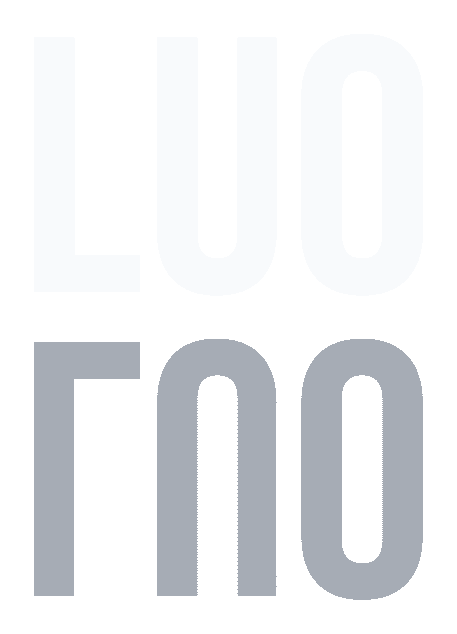

<a id="readme-top"></a>

<div align="center">



# Legal Uncertainty Oracle

**LUO is a Bittensor testnet subnet runtime for validator-scored legal uncertainty maps.**

[View Demo](https://alexfanzong.github.io/LUO/) ·
[Miner Entry Contract](public/miner_entry.json) ·
[Subnet Status](public/subnet_status.json) ·
[Map Packet Schema](public/map_packet.schema.json)

</div>

---

## What LUO Is

LUO is a public demo of a Bittensor-style subnet runtime where miners produce source-bound legal uncertainty maps and validators convert accepted submissions into UID weights.

LUO does not reward the most confident legal answer. It rewards map packets that preserve evidence boundaries, jurisdictional divergence, and unresolved gaps.

The current public runtime narrative is:

```text
Hotkey identity
  -> Synapse challenge
  -> schema-bound Map Packet response
  -> validator score
  -> hard-gated weight output
```

The flagship public challenge is `LUO-OUSG-XJ-V1`, an OUSG cross-jurisdiction map across the United States, Hong Kong, Singapore, and the European Union.

## Miner Entry

Miners join by hotkey identity. They receive a compact challenge payload with a question, jurisdiction scope, corpus manifest, and response schema.

The public challenge shape includes:

```json
{
  "challenge_id": "LUO-OUSG-XJ-V1",
  "question": "Map OUSG eligibility and transfer boundaries...",
  "required_jurisdictions": ["US", "HK", "SG", "EU"],
  "corpus_manifest": {
    "manifest_id": "luo-ousg-demo-manifest",
    "schema_uri": "/map_packet.schema.json",
    "as_of_date": "2026-06-07",
    "corpus_hash_commitment": "<corpus_hash_commitment>"
  }
}
```

Miner responses must be schema-bound Map Packet submissions. The public schema and a small sample packet live at:

- [public/map_packet.schema.json](public/map_packet.schema.json)
- [public/sample_map_packet.json](public/sample_map_packet.json)
- [public/miner_entry.json](public/miner_entry.json)
- [public/subnet_status.json](public/subnet_status.json)

## Validator Scoring

The public demo uses LUO scoring `v1.1`:

| Dimension | Weight | Meaning |
| --- | ---: | --- |
| `citation_validity` | 0.50 | Cited source IDs exist and support the claimed legal boundary. |
| `divergence_fidelity` | 0.30 | The packet preserves real jurisdictional disagreement instead of flattening it. |
| `reasoning_coherence` | 0.15 | Claims, source anchors, and conclusions form a coherent reasoning chain. |
| `coverage_breadth` | 0.05 | Required jurisdictions are covered without rewarding padding. |

Hard gate:

```text
fake source / missing source / mismatched source
  -> zero emission weight
```

The demo status file exposes the current runtime result:

```text
Round: LUO-OUSG-XJ-V1
Winner UID: 3
Winner score: 0.9625
Gate policy: invalid-source hit -> weight 0
```

## Commercial Roadmap

LUO starts with one narrow wedge: cross-border Web3 products that cannot afford fake legal certainty. Tokenized treasuries, stablecoin flows, custody models, sanctions-sensitive tools, and RWA distribution all share the same problem. Teams need to know where a claim is supported, where jurisdictions diverge, and where a model has filled a gap with confidence.

The first commercial users are compliance and product teams preparing market entry decisions. They do not need another chatbot. They need a source-bound packet they can hand to counsel, risk, BD, or an execution system without losing the legal boundary.

| Stage | Product | Buyer | Output |
| --- | --- | --- | --- |
| 1 | Public subnet demo | Builders, hackathon judges, early partners | A live proof that miners can submit legal uncertainty maps and validators can score them. |
| 2 | Benchmark rounds | RWA issuers, compliance teams, exchanges, custodians | Case-specific map packets for products such as tokenized treasuries, stablecoins, custody, and sanctions screening. |
| 3 | Review dashboard | Legal, risk, and product teams | A workspace for comparing jurisdictions, citations, unresolved gaps, and downstream-use limits. |
| 4 | API and packet layer | AI agent platforms, compliance tooling, and protocol teams | Machine-readable map packets that downstream systems can consume before execution. |
| 5 | Production subnet | Bittensor miners, validators, and enterprise customers | A market for source-backed legal map formation, with validator weights tied to citation validity and divergence fidelity. |

LUO can earn revenue before the full subnet is live. The near-term product is a paid benchmark and review workflow for high-value Web3 legal questions. The medium-term product is an API that returns reviewed Map Packets. The long-term product is a subnet where miners compete to form useful legal maps and validators reward packets that stay inside the evidence boundary.

The wedge is narrow on purpose. LUO should first become the best way to map legal uncertainty for programmable compliance. Once that loop works, the same packet format can support market-entry review, RWA onboarding, exchange listing checks, agent preflight, and compliance receipts.

## Local Development

Install dependencies:

```bash
npm install
```

Run the demo:

```bash
npm run dev -- --port 5177
```

Build the static frontend:

```bash
npm run build
```

The Vite build uses relative asset paths so the generated static bundle can be served from a GitHub Pages project path.

## Repository Structure

```text
.
├── index.html
├── package.json
├── public/
│   ├── luo_hero.html
│   ├── luo_dots.js
│   ├── miner_entry.json
│   ├── subnet_status.json
│   ├── map_packet.schema.json
│   └── sample_map_packet.json
├── src/
│   ├── components/
│   ├── data/
│   ├── assets/
│   ├── main.jsx
│   └── styles.css
├── docs/
├── pitch_demo_terminal/
└── submission_assets/
```

## Status

This repository is a demonstration build. It is not legal advice.

<p align="right">(<a href="#readme-top">back to top</a>)</p>
