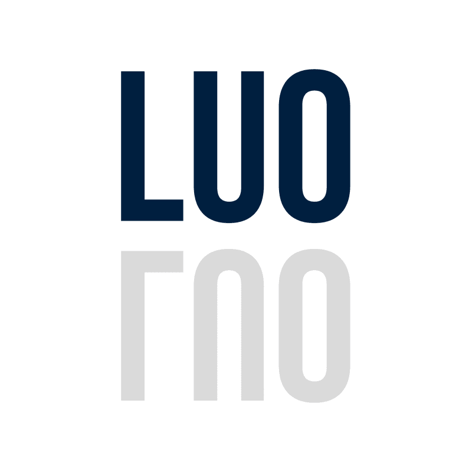

<div align="center">



<a id="readme-top"></a>

# Legal Uncertainty Oracle

**A Bittensor subnet for source-backed legal uncertainty maps in fast-changing domains.**

[View Demo](https://alexfanzong.github.io/LUO/) ·
[Miner Quickstart](docs/MINER_QUICKSTART.md) ·
[Miner Entry](public/miner_entry.json) ·
[Subnet Status](public/subnet_status.json) ·
[Map Packet Schema](public/map_packet.schema.json)

</div>

---

## What LUO Is

Legal Uncertainty Oracle (LUO) is a validator-scored subnet runtime for producing structured legal uncertainty maps.

LUO is built for questions where a single confident answer is risky: Web3, AI, RWA, cross-border compliance, sanctions-sensitive products, custody models, and other domains where rules move quickly across jurisdictions.

The core output is a **Map Packet**: a machine-readable artifact that links a concrete question to reviewed sources, jurisdictional divergence, unresolved gaps, and validator scores.

LUO is live on Bittensor testnet as **netuid 525**. The current public build demonstrates the miner challenge, packet submission, validator scoring, and UID weight settlement surface.

## Not A Legal AI Contest

LUO does not try to crown the best general-purpose legal agent.

For legal work, average model performance is less important than issue-specific reliability. A client does not buy the title of "best AI"; they need to know whether a particular answer to a particular question can be trusted, where it is supported, and where it remains uncertain.

LUO therefore scores the packet, not the brand of the model behind it.

Miners can use different models, retrieval systems, source pipelines, citation checkers, and domain-specific workflows. The validator evaluates the submitted packet against the question and source boundary.

## What Miners Build

Miners build structured legal uncertainty maps.

A miner does not return a free-form memo or a final legal opinion. It returns a schema-bound Map Packet that shows:

- which jurisdictions are in scope,
- which claims are supported by cited sources,
- where jurisdictions diverge,
- where the law is silent, conditional, or still changing,
- which inferences should not be made from the available sources.

This makes the miner output reusable by dashboards, counsel review, compliance tools, and downstream agents.

## Subnet Flow

```text
Concrete legal uncertainty question
  -> compact miner challenge
  -> schema-bound miner submission
  -> validator-scored Map Packet
  -> UID weight output
```

Miner-facing challenges are intentionally compact. A challenge contains:

- `challenge_id`
- `question`
- `required_jurisdictions`
- `corpus_manifest`
- `schema_uri`

The challenge does not ask a miner to produce free-form legal advice. It asks for a structured packet that can be checked.

## Miner Opportunity

LUO gives miners a concrete surface to compete on: source-backed legal map formation.

Miner advantage can come from:

- fresher and cleaner source pipelines,
- stronger jurisdiction-specific retrieval,
- better claim-to-citation binding,
- domain specialization in Web3, AI, RWA, sanctions, custody, or cross-border compliance,
- lower cost and lower latency,
- stable packet generation over repeated rounds.

The strongest miner is not merely the one with the most confident answer. It is the one that repeatedly submits packets that remain grounded when the question, jurisdiction mix, and source boundary change.

## How Rewards Are Earned

LUO does not pay a fixed bounty per answer.

Miner rewards come from Bittensor subnet emissions. Validators score submitted Map Packets and convert those scores into UID weights. A miner with stronger source grounding, better jurisdiction coverage, cleaner divergence mapping, and lower hallucination risk receives a larger share of miner emission for that round.

In other words, LUO defines the evidence and scoring market. Bittensor handles recurring emission and weight settlement.

## LUO Advantage

Legal and compliance work still needs experts. LUO does not replace counsel or final legal judgment.

LUO targets the repeatable infrastructure underneath that work: monitoring new regulatory sources, comparing jurisdictions, updating maps, and packaging uncertainty in a format downstream teams can inspect.

The advantage is scale and refreshability. A one-off legal memo can become stale. A subnet can keep re-scoring which miner is best at maintaining the map as the source landscape changes.

This is the technical bet behind LUO: the evidence layer of legal work can become structured, contestable, continuously updated, and economically rewarded.

## Reviewed Sources And Candidate Sources

The current demo starts from reviewed source packs and public benchmark cases.

In a production setting, miners may also surface candidate sources through their submissions. Candidate sources should not automatically enter the reviewed source base. They need validation for authenticity, date, jurisdiction, relevance, and claim support before they can influence later rounds.

This keeps LUO from becoming a raw data dump. The network rewards evidence mapping, not unreviewed accumulation.

## Scoring Philosophy

The public demo exposes LUO scoring at the level needed for integration:

| Dimension | Weight | What It Measures |
| --- | ---: | --- |
| `citation_validity` | 0.50 | Whether cited sources exist and support the claimed legal boundary. |
| `divergence_fidelity` | 0.30 | Whether the packet preserves real jurisdictional disagreement instead of flattening it. |
| `reasoning_coherence` | 0.15 | Whether claims, source anchors, and conclusions form a coherent chain. |
| `coverage_breadth` | 0.05 | Whether the required jurisdiction scope is covered without rewarding padding. |

Unsupported source claims are not eligible for emission weight in the validator round.

The public schema explains the expected packet shape. Live validation sets, challenge rotation, and production evaluation data are not part of this public demo surface.

## Rotating Validation

Public rules are useful. Fixed public validation surfaces are not.

LUO can rotate questions, jurisdiction combinations, source manifests, and validation checks across rounds. This allows miners to improve their evidence pipelines without turning the subnet into a fixed benchmark that can be memorized after one round.

The stable public contract is the packet format and scoring philosophy. The live validation surface can change.

## Public Artifacts

The public surface is enough for a new miner to understand the entry path, response shape, and scoring philosophy. Production validation operations are outside this demo repository.

- [docs/MINER_QUICKSTART.md](docs/MINER_QUICKSTART.md): miner onboarding and OUSG demo instructions
- [public/ousg_challenge.json](public/ousg_challenge.json): OUSG challenge payload
- [public/miner_submission_template.json](public/miner_submission_template.json): starter JSON template for participants
- [public/miner_entry.json](public/miner_entry.json): public miner entry contract
- [public/miner_submission.schema.json](public/miner_submission.schema.json): miner submission schema
- [public/sample_miner_submission.json](public/sample_miner_submission.json): example schema-bound submission
- [public/map_packet.schema.json](public/map_packet.schema.json): accepted Map Packet schema
- [public/subnet_status.json](public/subnet_status.json): public demo round status

## Commercial Wedge

LUO starts narrow: high-uncertainty legal domains where ordinary search and static memos age quickly.

The first users are product, compliance, and legal teams evaluating market entry, tokenized asset distribution, custody structure, sanctions exposure, AI governance obligations, or cross-border operating constraints.

LUO does not replace counsel. It standardizes the evidence layer that counsel and downstream systems can review.

| Stage | Product | Output |
| --- | --- | --- |
| 1 | Testnet subnet | Netuid 525 with registered validator and baseline miner. |
| 2 | Benchmark rounds | Case-specific Map Packets for high-value Web3 and AI legal questions. |
| 3 | Review dashboard | A workspace for comparing citations, jurisdictions, uncertainty, and unresolved gaps. |
| 4 | Packet API | Machine-readable packets for compliance tools and downstream agents. |
| 5 | Production subnet | A market where miners compete on source-backed legal map maintenance. |

## Local Development

Install dependencies:

```bash
npm install
```

Run the demo:

```bash
npm run dev -- --port 5177
```

Build the static frontend:

```bash
npm run build
```

The Vite build uses relative asset paths so the generated static bundle can be served from a GitHub Pages project path.

## Repository Structure

```text
.
├── index.html
├── package.json
├── public/
│   ├── luo_hero.html
│   ├── luo_dots.js
│   ├── miner_entry.json
│   ├── subnet_status.json
│   ├── map_packet.schema.json
│   ├── miner_submission.schema.json
│   └── sample_miner_submission.json
├── src/
│   ├── components/
│   ├── data/
│   ├── assets/
│   ├── main.jsx
│   └── styles.css
└── docs/
```

## Status

This repository is a research and demonstration build. It is not legal advice, not a legal opinion, and not a basis for offering, transfer, or compliance decisions.

<p align="right">(<a href="#readme-top">back to top</a>)</p>
